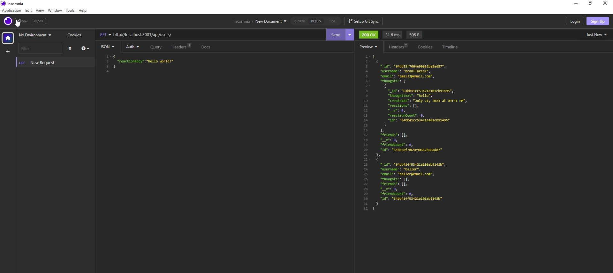

# NoSQL-Social-Network-API

## Description

In this project, I created a server that aims to replicate a social network. I created 2 models (User and Thought) as well as another Schema (Reaction) to accomplish this. I built this project to test my ability and knowledge of MongoDB, Mongoose, and their practical usages with Express and server design. This project helped me learn how to use a non-relational database in MongoDB and how to use it within Node.js.

## Installation

To install my project, simply clone the repository, and run "npm i" in the necessary folder to install all the dependencies needed to run the program. 

## Usage

Once the necessary node packages have been installed with "npm i", the user just needs to run "npm start" to begin test routes in either Insomnia or localhost.

https://github.com/brianlucla/NoSQL-Social-Network-API

## Credits

I received help from my TA's with routing and email validation.

## License

Please refer to the license in the Github Repository.
